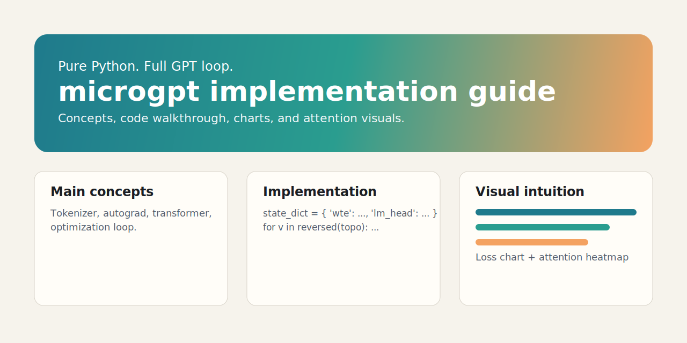

# microgpt docs site

Public GitHub Pages documentation for Karpathy's `microgpt.py` implementation, with visual explanations and runnable examples.

## Features

- Hero section with badges and quick links
- Context-first concepts section before code
- Full embedded `microgpt.py` core source block
- Split-screen guided code map with synchronized commentary
- Keyboard navigation for guided map steps (arrows, Home/End, Enter/Space)
- Line-range anchors from concept cards into the full embedded code view
- Copyable deep links for anchor ranges with mobile-friendly toast feedback
- Step-by-step walkthrough after the full code listing
- Code snippets with commentary and enhanced visual code rendering
- Visuals: training curve chart, attention heatmap, and animated token flow
- Support / donation section for project sustainability
- GitHub Actions CI: formatting + docs integrity + Lighthouse quality audit
- Lighthouse threshold profiles: softer PR gates, stricter main branch gates

## Attribution

Core algorithm inspiration and referenced snippets come from Andrej Karpathy's gist:

- https://gist.github.com/karpathy/8627fe009c40f57531cb18360106ce95

## Local preview

Open `docs/index.html` in your browser.

## Enable GitHub Pages

1. Push this repository to GitHub.
2. In repository settings, go to **Pages**.
3. Set source to **Deploy from a branch**.
4. Select branch `main` and folder `/docs`.
5. Save and wait for Pages to publish.

## Donation links

Support links live in `docs/index.html` under the `#support` section. Replace with your own profiles if you fork this repo.

## Custom domain (optional)

1. Copy `docs/CNAME.example` to `docs/CNAME`.
2. Replace `docs.example.com` with your real domain.
3. Commit and push.
4. In GitHub repo settings, open **Pages** and set the same custom domain.
5. Configure DNS with a `CNAME` record pointing to `<your-user>.github.io`.

## License

MIT - see `LICENSE`.
